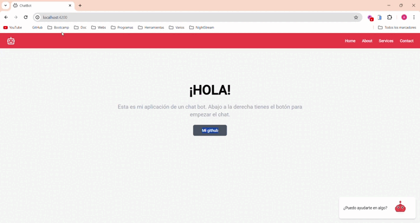
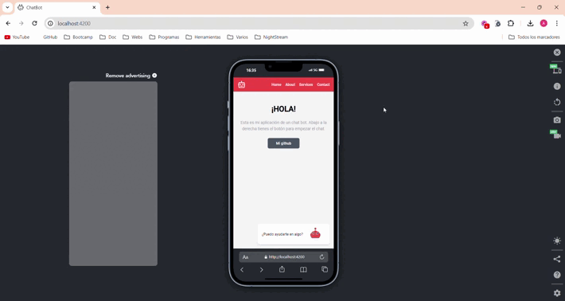

# ChatBot

## Introducción

¡Hola! Este es el proyecto que he realizado sobre crear una ventana de chat para poder comunicarte con un bot en una web. Es una aplicación sencilla donde tendremos una home y un pequeño espacio reservado para nuestro ChatBot.

## Atención

**Es importante destacar que el bot no funcionará en la aplicación proporcionada, ya que las claves de acceso son privadas. Sin embargo, se facilita una carpeta llamada "environments" para que los usuarios puedan agregar sus propias claves y probar la funcionalidad del bot.**

## Frameworks y Librerías utilizadas

- **Angular CLI version 17.2.3.**
- **Tailwind**
- **openAi**
- **Angular material**

## Requisitos

- Puedes usar cualquier framework de JavaScript, obtendrás puntos adicionales si usas Vue.js v3.0.0 o Angular v^16.0.0. ✅

- Los mensajes del chatbot deben ser diferentes a los del usuario, posicionándolos a la derecha e izquierda es la manera más fácil de cumplir con este requisito 😉. ✅

- La imagen y el nombre del chatbot deben aparecer para que el usuario sepa en todo momento con quién está hablando. ✅

- La ventana de chat debe tener un menú desplegable para seleccionar opciones como olvidar datos del usuario, cambiar el idioma o acceder a la política de privacidad. ✅

- Nuestros chatbots no solo envían mensajes de texto, tendrás que implementar: ✅

  - Mensajes tipo tarjeta de imagen
  - Tarjetas de chat
  - Botones de chat
  - Otros tipos de mensajes o mejoras que consideres una buena implementación.

- El diseño no tiene que ser súper sofisticado, pero al menos debe ser responsivo y a pantalla completa en teléfonos móviles. ✅

### Requisitos adicionales

- Dockerizar la aplicación.
- Mostrar un llamado a la acción antes del chatbot.
- Escribir pruebas unitarias/end-to-end realistas.

## Descripción del proyecto

El proyecto consiste en desarrollar una ventana de chat para interactuar con un bot en una página web. He utilizado Angular 17.2.3 como el framework principal, junto con Tailwind, OpenAI y Angular Material para diferentes funcionalidades y estilos.

La aplicación se compone de una página de inicio y un espacio dedicado al chatbot. El bot utiliza la API de OpenAI con el motor "gpt-3.5-turbo" para generar respuestas a las consultas de los usuarios. El chat está diseñado para aceptar consultas de hasta 300 caracteres.

En cuanto a los requisitos, se ha cumplido con la mayoría de ellos. El diseño de la ventana de chat es responsivo y funciona a pantalla completa en dispositivos móviles. Además, se han implementado mensajes tipo tarjeta de imagen, tarjetas de chat, botones de chat y otras mejoras varias.

## Vistas del proyecto

- **Vista escritorio:**

  

- **Vista móvil:**

  

## Observaciones y futuras mejoras

- **Un cargando respuesta en el chat:**
Debido al tiempo en que la aplicación se comunica con la api y esta devuelve una respuesta, transcurre un tiempo. En este periodo de tiempo, es necesario añadir un componente el cual se muestre al usuario como por ejemplo un "Respondiend..." o un simple spinner para mejorar la experiencia de usuario. 

Esto no lo he implementado en mi aplicación debido a la falta de tiempo y que no lo veo muy necesario ya que el bot no va a mandar nada a la api ya que no dispone de un token. Pero en un futuro y cuando la aplicación esté más testeada se lo añadiré ya que es un gran plus.

- **Diseño**
Aunque el diseño no está mal (es simple pero eficaz) me gustaría en un futuro darle otra vuelta ya que sé que se podría mejorar mucho tanto la ui como la ux.

- **Optimización y mejoras**
La aplicación aunque sea simple y funcione perfectamente, siempre se puede mejorar (limpiar código, optimizar cargas, implementar mejoras...)
